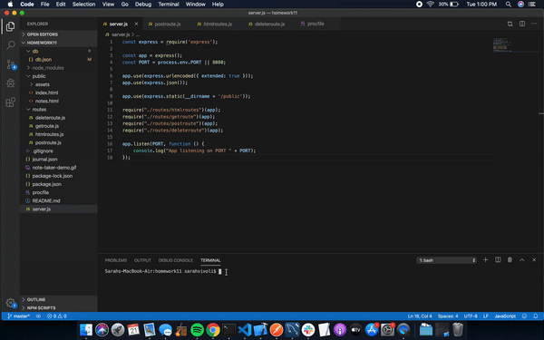

# Note-Taker

## Links to project


## Instructions

1. With terminal pointing toward the project's directory, enter the following command:
```sh
heroku local web
```
- Terminal should return the message, "App listening on PORT 8080"
2. Open up your browser and navigate to "localhost:8080"
3. Click the "Get Started" button to open up the notes page
To add a note:
1. Enter in a note title and note text
2. Click the save icon in the upper right corner of the page. Your note will be saved to the list on the left side of the page.
* If you are viewing another note and wish to add a note, click the pencil icon in the upper right corner of the page and follow the above steps.
To delete a note:
1. Click the red trash can icon next to the note you wish to delete.

## Description

A note taking application that allows users to create, save, and delete notes. This allows users to organize their thoughts and keep track of tasks.

### Node Modules

1. Express

### Website Components

1. Home page
- Navbar
- Title
- Button to enter notes page
2. Notes page
- Navbar
- Link to home page
- Save button, write new note button
- Saved notes list
- New note inputs - title, text body
- Saved note display
3. Bootstrap
4. Google Fonts
5. FontAwesome icons

## User Experience



## Developer Experience

After having completed the command line applications, the PDF Generator and the Team Builder, this project felt like less of a challenge. I am feeling comfortable with node and am enjoying exploring the versatility of api routes. I took some extra time to personalize the premade html files and had some fun playing with the fonts and design of the website. 

--Sarah


